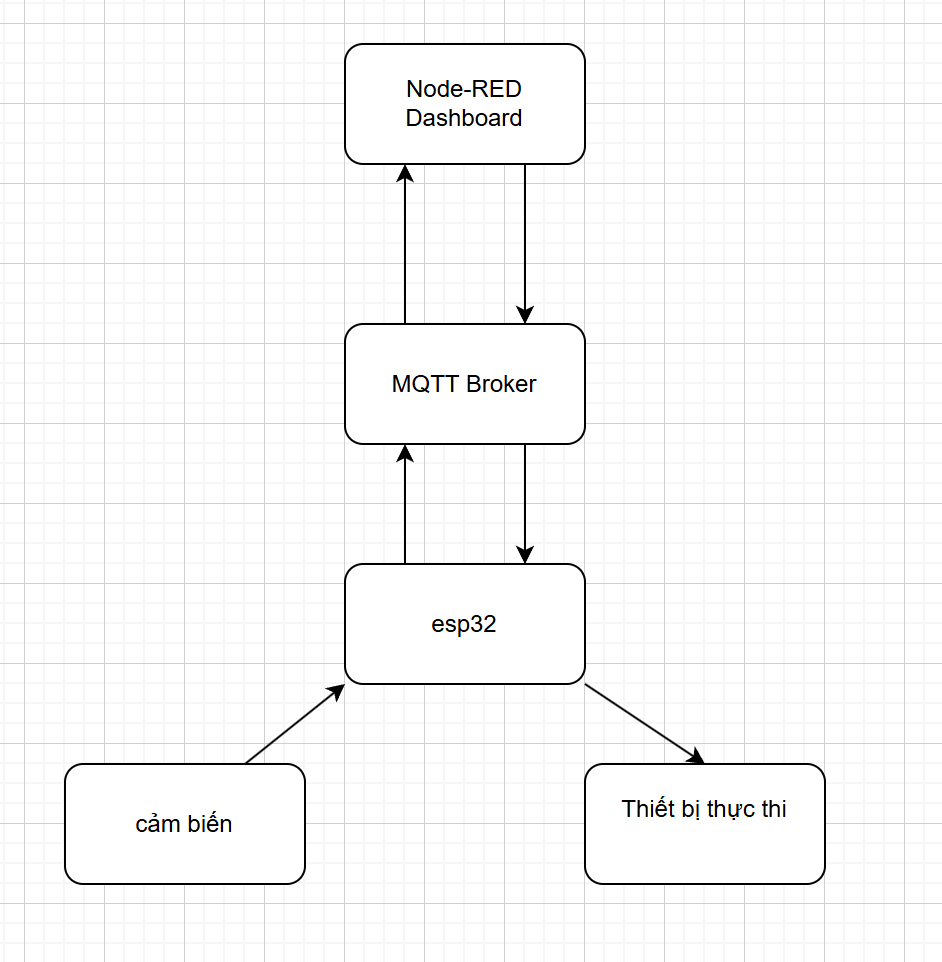

# Smart Greenhouse IoT System - Midterm Project

## Mô tả dự án
Đây là một dự án IoT giữa kỳ với mục tiêu xây dựng hệ thống điều khiển ánh sáng tự động trong nhà kính. Hệ thống sử dụng **ESP32**, cảm biến ánh sáng, và đèn LED để điều chỉnh ánh sáng phù hợp. Hệ thống giao tiếp qua giao thức **MQTT** và cung cấp giao diện điều khiển từ xa bằng **Node-RED Dashboard**.

Dự án này sẽ được mở rộng trong bài tập cuối kỳ với các tính năng điều khiển môi trường toàn diện hơn. Chi tiết về dự án cuối kỳ có thể được tìm thấy ở file `README.md` trong nhánh `final`.

## Tính năng chính
- **Điều khiển ánh sáng tự động:** Hệ thống tự động điều chỉnh đèn LED dựa trên dữ liệu từ cảm biến ánh sáng.
- **Giao diện điều khiển từ xa:** Người dùng có thể theo dõi và điều khiển trạng thái đèn LED thông qua giao diện **Node-RED Dashboard**.
- **Giao tiếp qua MQTT:** Hệ thống sử dụng giao thức MQTT để trao đổi dữ liệu giữa ESP32 và Node-RED.

## Sơ đồ khối hệ thống
### Cảm biến ánh sáng → ESP32
- Thu thập dữ liệu từ cảm biến ánh sáng.
- ESP32 xử lý dữ liệu và quyết định bật/tắt đèn LED.

### ESP32 → MQTT Broker
- Gửi dữ liệu cảm biến ánh sáng và trạng thái đèn LED tới MQTT Broker.

### MQTT Broker → Node-RED Dashboard
- Node-RED Dashboard nhận dữ liệu từ MQTT Broker để hiển thị trạng thái ánh sáng và trạng thái đèn.

### Node-RED Dashboard → MQTT Broker → ESP32
- Người dùng gửi lệnh điều khiển từ giao diện Node-RED tới ESP32 thông qua MQTT Broker.

### ESP32 → Thiết bị thực thi
- ESP32 điều khiển bật/tắt đèn LED dựa trên dữ liệu cảm biến hoặc lệnh từ người dùng.

Hệ thống được thiết kế với luồng thông tin như sau:

## Đặt bài toán
Việc điều chỉnh ánh sáng trong nhà kính là rất quan trọng để đảm bảo sự phát triển của cây trồng. Dự án giữa kỳ này tập trung vào việc tự động hóa điều khiển ánh sáng trong nhà kính, giúp tiết kiệm năng lượng và giảm công sức lao động.

## Các bước triển khai

### 1. Kết nối phần cứng
- Đấu nối cảm biến ánh sáng và đèn LED với ESP32 qua module relay.

### 2. Cài đặt phần mềm
- Lập trình ESP32 bằng **PlatformIO** để thu thập dữ liệu từ cảm biến và gửi dữ liệu qua **MQTT Broker**.
- Cài đặt **Node-RED** để thiết kế giao diện điều khiển và hiển thị thông tin.

### 3. Cài đặt giao thức MQTT
- Sử dụng một broker MQTT (online hoặc local) để truyền tải dữ liệu giữa ESP32 và Node-RED.

### 4. Thiết kế giao diện trên Node-RED
- Tạo các widget trên Dashboard để hiển thị trạng thái cảm biến ánh sáng và điều khiển đèn LED.

### 5. Kiểm tra và hoàn thiện hệ thống
- Đảm bảo dữ liệu được truyền tải ổn định qua MQTT, và giao diện Node-RED Dashboard hoạt động đúng chức năng.

## Kết quả dự kiến
- Giao diện **Node-RED** hiển thị dữ liệu cảm biến ánh sáng và trạng thái đèn LED.
- Tự động điều chỉnh đèn LED dựa trên ánh sáng môi trường.
- Giao diện điều khiển đơn giản, dễ sử dụng trên máy tính và smartphone.

## Yêu cầu hệ thống
- **Phần cứng:** ESP32, cảm biến ánh sáng, relay module, đèn LED.
- **Phần mềm:** PlatformIO, Node-RED, MQTT Broker.

## Hướng dẫn sử dụng
1. Kết nối các phần cứng theo sơ đồ.
2. Tải chương trình lên ESP32.
3. Thiết lập broker MQTT và giao diện Node-RED.
4. Theo dõi và điều khiển hệ thống thông qua Node-RED Dashboard.

---
