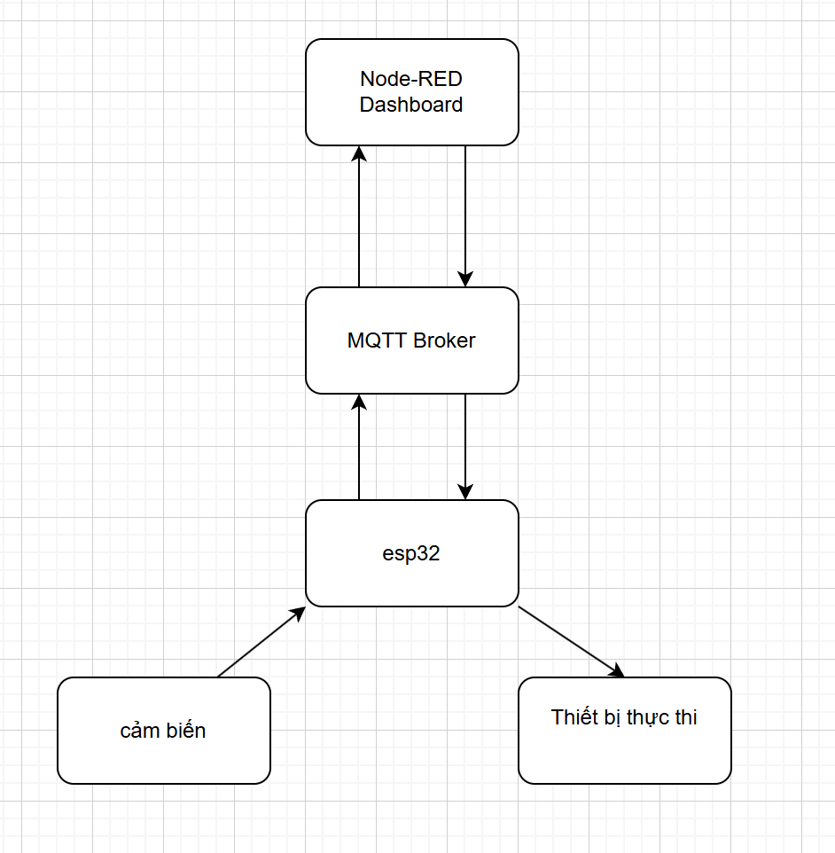

# Smart Greenhouse IoT System

## Mô tả dự án
Dự án này xây dựng một hệ thống điều khiển thông minh cho nhà kính trồng cây, nhằm duy trì các yếu tố môi trường như ánh sáng, độ ẩm đất và nhiệt độ trong khoảng tối ưu. Hệ thống sử dụng **ESP32** làm vi điều khiển, các cảm biến môi trường để thu thập dữ liệu, và giao thức **MQTT** để trao đổi thông tin qua một broker online. Người dùng có thể theo dõi và điều khiển hệ thống từ xa thông qua giao diện **Node-RED Dashboard**.

## Tính năng chính
- **Điều khiển ánh sáng:** Dựa vào cảm biến ánh sáng, hệ thống tự động điều chỉnh đèn LED để cung cấp đủ ánh sáng cho cây trồng.
- **Tưới nước tự động:** Khi độ ẩm đất thấp, máy bơm nước sẽ tự động bật để tưới cây.
- **Quản lý nhiệt độ:** Cảm biến nhiệt độ giúp điều chỉnh quạt làm mát khi nhiệt độ trong nhà kính quá cao.
- **Giao diện điều khiển từ xa:** Người dùng theo dõi thông số môi trường và điều khiển các thiết bị thực thi qua một giao diện web hoặc ứng dụng smartphone sử dụng Node-RED.

## Sơ đồ khối hệ thống
### Cảm biến → ESP32
- Thu thập dữ liệu từ các cảm biến môi trường (ánh sáng, độ ẩm đất, nhiệt độ).
- ESP32 xử lý dữ liệu và kiểm tra các ngưỡng cài đặt để quyết định tự động điều khiển thiết bị.

### ESP32 → MQTT Broker
- Gửi dữ liệu cảm biến (thông tin ánh sáng, độ ẩm đất, nhiệt độ) tới MQTT Broker.

### MQTT Broker → Node-RED Dashboard
- Node-RED Dashboard nhận dữ liệu từ MQTT Broker và hiển thị các thông số môi trường cho người dùng.

### Node-RED Dashboard → MQTT Broker → ESP32
- Người dùng điều khiển thiết bị thực thi thủ công từ giao diện (ví dụ: bật/tắt đèn LED, bơm nước, quạt).
- Lệnh được truyền từ Node-RED Dashboard tới ESP32 thông qua MQTT Broker.

### ESP32 → Thiết bị thực thi
- ESP32 nhận lệnh điều khiển từ người dùng hoặc từ các cảm biến để điều chỉnh thiết bị thực thi (đèn LED, máy bơm nước, quạt làm mát).

### ESP32 → MQTT Broker → Node-RED Dashboard
- ESP32 gửi trạng thái của thiết bị (bật/tắt) ngược lại MQTT Broker.
- Node-RED Dashboard cập nhật trạng thái thiết bị để người dùng theo dõi.

Hệ thống được thiết kế với luồng thông tin như sau:

## Đặt bài toán
Trong bối cảnh nhu cầu trồng rau hữu cơ ngày càng tăng, việc sử dụng nhà kính giúp tối ưu hóa việc trồng cây và bảo vệ cây trồng khỏi các yếu tố bên ngoài. Tuy nhiên, việc duy trì điều kiện môi trường lý tưởng trong nhà kính một cách thủ công rất tốn thời gian và công sức. Dự án này tự động hóa các quy trình như điều khiển ánh sáng, tưới nước và kiểm soát nhiệt độ trong nhà kính thông qua công nghệ IoT, giúp giảm thiểu công sức lao động và tiết kiệm tài nguyên.

## Các bước triển khai

### 1. Kết nối phần cứng
- Đấu nối các cảm biến ánh sáng, độ ẩm đất, và nhiệt độ với ESP32.
- Kết nối máy bơm, quạt và đèn LED qua các module relay.

### 2. Cài đặt phần mềm
- Lập trình ESP32 bằng **PlatformIO** với giao thức **MQTT** để thu thập dữ liệu từ cảm biến và gửi qua MQTT Broker.
- Cài đặt Node-RED để thiết kế giao diện điều khiển và theo dõi.

### 3. Cài đặt giao thức MQTT
- Sử dụng một broker MQTT để truyền tải dữ liệu giữa ESP32 và Node-RED.

### 4. Thiết kế giao diện trên Node-RED
- Tạo các widget trên Dashboard để hiển thị dữ liệu cảm biến (độ sáng, độ ẩm đất, nhiệt độ) và các điều khiển cho đèn LED, máy bơm, quạt.

### 5. Kiểm tra và hoàn thiện hệ thống
- Đảm bảo hệ thống hoạt động ổn định, các thông số được điều khiển và theo dõi chính xác.

## Kết quả dự kiến
- Giao diện **Node-RED** hiển thị thông tin từ các cảm biến (độ sáng, độ ẩm đất, nhiệt độ) và cho phép điều khiển các thiết bị (đèn LED, máy bơm, quạt).
- Tự động điều chỉnh các yếu tố môi trường trong nhà kính (ánh sáng, độ ẩm, nhiệt độ) dựa trên ngưỡng cài đặt trước.
- Giao diện điều khiển dễ sử dụng trên cả máy tính và smartphone.

## Yêu cầu hệ thống
- **Phần cứng:** ESP32, cảm biến ánh sáng, cảm biến độ ẩm, nhiệt độ, relay module, đèn LED, máy bơm nước, quạt.
- **Phần mềm:** PlatformIO, Node-RED, MQTT Broker.

## Hướng dẫn sử dụng
1. Kết nối các phần cứng theo sơ đồ.
2. Tải chương trình lên ESP32.
3. Thiết lập broker MQTT và giao diện Node-RED.
4. Theo dõi và điều khiển hệ thống thông qua Node-RED Dashboard.

---
