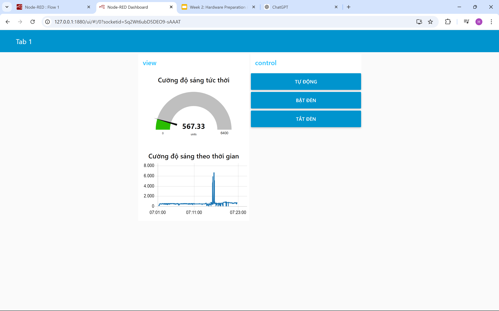

# **Greenhouse Monitoring and Control System**

## **Giới thiệu**
Dự án này là một hệ thống giám sát và điều khiển ánh sáng trong nhà kính thông qua cảm biến ánh sáng (quang trở) và MQTT. 
Hệ thống hỗ trợ hai chế độ điều khiển:
1. **Chế độ thủ công (Manual):** Người dùng bật/tắt đèn qua Node-RED Dashboard.
2. **Chế độ tự động (Auto):** Đèn sẽ tự động bật/tắt dựa trên độ sáng môi trường.

Dữ liệu cảm biến và trạng thái hệ thống được truyền và nhận thông qua MQTT Broker bảo mật (TLS) bằng HiveMQ Cloud.

---

## **Phần cứng**
1. **Vi điều khiển:** ESP32.
2. **Cảm biến ánh sáng:** Quang trở (kết nối qua chân ADC, pin 35 trên ESP32).
3. **Relay module:** Điều khiển đèn (pin 19 trên ESP32).
4. **Mạch điện trở phân áp:** Để đo độ sáng chính xác từ cảm biến.
5. **Nguồn điện:** 3.3V và 5V cho các module.

---

## **Phần mềm**
1. **Node-RED:** Xây dựng giao diện và xử lý dữ liệu.
2. **HiveMQ Broker:** MQTT Broker hỗ trợ giao thức bảo mật TLS.
3. **PlatformIO:** Viết chương trình cho ESP32.

---

## **Chức năng**
### **ESP32**
1. **Gửi dữ liệu cảm biến:**
   - Đọc giá trị độ sáng từ cảm biến và gửi qua topic `greenhouse/light`.
2. **Điều khiển đèn:**
   - Nhận lệnh từ topic `greenhouse/control`:
     - **"ON":** Bật đèn (chế độ thủ công).
     - **"OFF":** Tắt đèn (chế độ thủ công).
     - **"AUTO":** Kích hoạt chế độ tự động.

3. **Chứng chỉ bảo mật (TLS):**
   - ESP32 sử dụng chứng chỉ Root CA để kết nối bảo mật với HiveMQ Cloud.

### **Node-RED Dashboard**
1. **Hiển thị dữ liệu:**
   - Đồ thị hiển thị độ sáng theo thời gian (`greenhouse/light`).
   - Giá trị độ sáng tức thời.
2. **Điều khiển:**
   - Chuyển chế độ giữa **Tự động**, **Bật đèn**, và **Tắt đèn** qua topic `greenhouse/control`.

---

## **Cài đặt**
### **1. Thiết lập ESP32**
1. Cài đặt thư viện cần thiết:
   - [WiFi](https://platformio.org/lib/show/870/WiFi)
   - [PubSubClient](https://platformio.org/lib/show/89/PubSubClient)
2. Sử dụng file code Arduino như trên (`main.cpp`) và biên dịch trên **PlatformIO**.
3. Sửa thông tin mạng WiFi, MQTT Broker và chứng chỉ trong file.

### **2. Node-RED**
1. Cài đặt Node-RED trên máy tính hoặc server.
2. Cài đặt Dashboard UI:
   ```bash
   npm install node-red-dashboard
   ```
3. Import Flow:
   - Dựa trên hình ảnh, cấu trúc flow bao gồm:
     - Topic `greenhouse/light`: Hiển thị dữ liệu độ sáng.
     - Topic `greenhouse/control`: Điều khiển hệ thống.

---

## **Cách sử dụng**
1. **Kết nối phần cứng**:
   - Đảm bảo ESP32 đã kết nối với cảm biến ánh sáng và module relay.
2. **Chạy ESP32**:
   - Nạp mã nguồn và kết nối với MQTT Broker.
3. **Mở Node-RED Dashboard**:
   - Truy cập tại [http://127.0.0.1:1880/ui](http://127.0.0.1:1880/ui).
4. **Giám sát và điều khiển:**
   - Xem đồ thị độ sáng.
   - Chọn chế độ **Tự động**, **Bật đèn**, hoặc **Tắt đèn** để điều khiển relay.

---

## **Cấu trúc MQTT Topics**
- **`greenhouse/light`:**
  - ESP32 gửi dữ liệu độ sáng hiện tại (Lux).
- **`greenhouse/control`:**
  - Node-RED gửi lệnh điều khiển:
    - `"ON"`: Bật đèn.
    - `"OFF"`: Tắt đèn.
    - `"AUTO"`: Chuyển chế độ tự động.

---

## **Hình ảnh và Video Demo**
- **Ảnh giao diện Node-RED Dashboard:** 
  
  
- **Video demo hệ thống:** 
  


---

Em sẽ hoàn thiện đề tài trong bài cuối kì.
